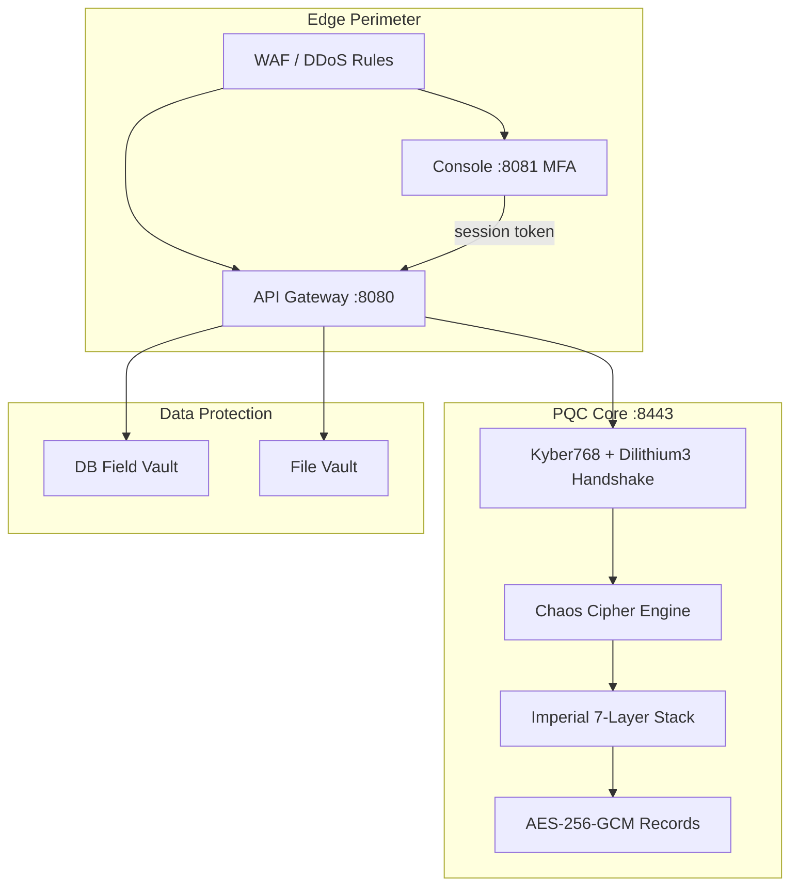

<div align="center">

# ◈ NOMAD CYBER ALGORITHM

### Post-Quantum Sovereign Security Stack

[](https://www.typescriptlang.org/)
[](https://nodejs.org/)
[](https://openquantumsafe.org/)
[](src/tests/)
[](LICENSE)

**Quantum-resistant microservice mesh · Chaos cipher (no wire patterns) · Full security perimeter**

<br/>

```
╔══════════════════════════════════════════════════════════════════════════╗
║  KYBER1024 KEM →  QS-CA + CT Log  →  Imperial Cipher Stack  →  GCM    ║
║  DILITHIUM5 SIG →  WebAuthn + ZK Auth  →  Chaos Mode (no pattern)     ║
║  HSM + TPM  →  Gateway + Vaults  →  SBOM + SAST/DAST CI gates         ║
╚══════════════════════════════════════════════════════════════════════════╝
```

<br/>

[Overview](#-overview) ·
[Sovereign Organism](#-sovereign-organism) ·
[Architecture](#-architecture) ·
[Quick Start](#-quick-start) ·
[Security](#-security-model) ·
[Chaos Mode](#-chaos-mode) ·
[Configuration](#-configuration) ·
[Tests](#-tests)

</div>

---

## ◇ Overview

**Nomad Cyber Algorithm** is a TypeScript post-quantum cryptography (PQC) stack for securing microservice communication and sensitive data — **created by [Aureon Software](https://aureonai.app/)** and used in special ways by **[ARVOR](https://arvor.xyz/)** for zero-knowledge encrypted messaging and private vault operations.

It combines:

- **Kyber1024** key encapsulation and **Dilithium5** signatures (production default)
- **QS-CA** certificate pinning with mutual authentication
- **Imperial cipher stack** (7 historical layers) + **Aureon occult veil**
- **Chaos mode** — per-message unpredictable layer order, padding, and timing jitter
- **Sovereign stack** — API gateway, MFA console, DB field encryption, file vault
- **Edge templates** — nginx WAF and Cloudflare rules, Kubernetes Helm chart

Designed for high-assurance environments: air-gapped networks, SCI/TS workloads, and forward-looking post-quantum architectures.

| Capability | Implementation |
|:---|:---|
| **Key Exchange** | Kyber1024 (ML-KEM) via OQS |
| **Authentication** | Dilithium5 + QS-CA cert verification + CT log |
| **Data Channel** | Imperial cipher → AES-256-GCM + HKDF |
| **Unpredictability** | Chaos padding, layer shuffle, timing veil |
| **Perimeter** | Gateway RBAC, console MFA, rate limits |
| **Data at Rest** | DB field vault + encrypted file vault |
| **Transport** | Length-prefixed TCP framing + optional sidecar |

---

## ◇ Sovereign Organism

Nomad is not a bag of security features — it is a **living organism** where every subsystem is an organ that depends on the others. Damage one organ and the entire body enters **lockdown**. An attacker cannot pick off a single layer; they must breach **all eleven organs simultaneously** while the organism pulses every 30 seconds re-verifying the full chain.

```
                    ┌─────────────────────────────────────┐
                    │         SOVEREIGN ORGANISM          │
                    │   pulse → verify all → vital|die    │
                    └─────────────────────────────────────┘
           ┌────────┼────────┬────────┬────────┬────────┼────────┐
           ▼        ▼        ▼        ▼        ▼        ▼        ▼
      Crypto    Audit     TPM      HSM      QS-CA   Console   Redis
      Core     Immune   Skeletal   Heart    Liver    Brain    Nerves
       ♥         🛡        🦴        ♥        🫀       🧠       ⚡
           └────────┴────────┴────────┴────────┴────────┴────────┘
                              │
                    PQC Lungs · Gateway Skin · Vault Marrow
```

| Organ | Role | Depends On |
|:---|:---|:---|
| **Crypto Core** ♥ | liboqs Kyber+Dilithium self-test | — |
| **Supply Spleen** | SBOM hash verification | Crypto Core |
| **Audit Immune** 🛡 | Chained HMAC tamper-evident log | Crypto Core |
| **TPM Skeletal** 🦴 | Boot PCR attestation | Crypto Core |
| **HSM Heart** | Non-extractable hardware keys | Crypto, TPM, Audit |
| **CA Liver** 🫀 | QS-CA + certificate transparency | Crypto, Audit, HSM |
| **Console Brain** 🧠 | Argon2id + WebAuthn + ZK proof | Audit, CA Liver |
| **Rate Nerves** ⚡ | Distributed Redis rate limits | Audit |
| **PQC Lungs** | Kyber/Dilithium secure channels | HSM, CA, Audit, Crypto |
| **Gateway Skin** | RBAC perimeter + session auth | Console, PQC, Audit, Nerves |
| **Vault Marrow** | Encrypted data-at-rest | TPM, HSM, Audit, Crypto |

### Doctrine

> **Partial compromise = total shutdown.**  
> Breach the audit chain → lockdown. Lose TPM attestation → lockdown. HSM disconnects → lockdown.  
> Vault encryption binds to the organism fingerprint — data sealed under one pulse cannot be read under another.

```bash
# Inspect live organ vitals (public endpoint)
curl http://localhost:8080/organism/vitals

# Pulse interval (default 30s — re-verifies ALL organs)
NOMAD_ORGANISM_PULSE_MS=30000
```

---

## ◇ Architecture



### Handshake Flow

| Step | Actor | Action |
|:---:|:---|:---|
| 1 | Client | `client_hello` or `session_resume` (signed proof) |
| 2 | Server | `server_hello` — pinned KEM + fresh QS-CA cert |
| 3 | Client | Verify cert matches hello keys; Kyber encapsulate |
| 4 | Client | `client_auth_response` — ciphertext + Dilithium signature |
| 5 | Server | Verify signature, allowlist check, decapsulate |
| 6 | Server | `server_auth_response` — signed + session ticket |
| 7 | Both | `encrypted_data` with strict sequence +1, chaos cipher, GCM |

---

## ◇ Quick Start

### Prerequisites

- **Node.js** 20+
- **npm** 10+

### Install & Run

```bash
git clone https://github.com/ZorakCorp/nomad_cyber_algorithm.git
cd nomad_cyber_algorithm
npm install
npm run build

# PQC microservice demo (chaos mode on)
npm start

# Full sovereign stack (gateway + console + vaults + PQC)
npm run start:sovereign
```

### Expected Output

```
[CHAOS] Unpredictable cipher mode: ACTIVE (no wire patterns)
[DEMO] Session ticket issued (...). Resumption-ready.
[DEMO] Server metrics: { "handshakesSucceeded": 1, ... }
```

---

## ◇ Security Model

### Defense in Depth

| Layer | Protection |
|:---|:---|
| **Edge WAF** | DDoS rate limits, SQLi/path traversal blocks (`deploy/waf/`) |
| **API Gateway** | RBAC, body size limits, security headers, session auth |
| **Console** | scrypt passwords, RFC 6238 TOTP MFA, rate-limited MFA attempts |
| **PQC Handshake** | QS-CA cert pin, allowlist, replay guard, rate limits |
| **Record Layer** | AES-256-GCM with AAD (`correlationId:sequence:recordType`) |
| **Session Tickets** | AES-GCM encrypted, HMAC-sealed, one-time consume |
| **DB Vault** | Per-field AES-256-GCM with tenant-bound AAD |
| **File Vault** | AES-256-GCM at rest, object ID validation, owner check |

### Production Checklist

```bash
# Required for production (dev mode OFF)
NOMAD_DEV_MODE=false
NOMAD_ALGORITHM_SUITE=kyber1024_dilithium5
NOMAD_CONSOLE_ADMIN_PASSWORD=<strong-password-20+chars>
NOMAD_WEBAUTHN_REQUIRED=true
NOMAD_WEBAUTHN_CREDENTIAL_ID=<base64url-credential-id>
NOMAD_WEBAUTHN_PUBLIC_KEY=<base64url-public-key>
NOMAD_HSM_ENABLED=true
NOMAD_PKCS11_LIB=/path/to/libpkcs11.so
NOMAD_DB_VAULT_KEY_PATH=/secrets/db-vault.key    # 64 hex chars
NOMAD_FILE_VAULT_KEY_PATH=/secrets/file-vault.key
NOMAD_QS_CA_ROOT_PATH=/secrets/qs-ca-root.b64
NOMAD_CLIENT_ALLOWLIST=<base64-dilithium-pubkeys>
NOMAD_AUDIT_CHAIN_KEY=<64-hex-chars>
```

> **Note:** `@open-quantum-safe/oqs-javascript` ships as a local stub at `vendor/oqs-javascript/`. Replace with real liboqs bindings for production PQC.

---

## ◇ Chaos Mode

Chaos mode eliminates predictable wire patterns — every message looks different even with identical plaintext.

| Mechanism | Effect |
|:---|:---|
| **Layer shuffle** | Hieroglyph / Augustan / Scytale order changes per message (key-derived) |
| **Chaotic padding** | 16–272 byte random prefix + 8–128 byte suffix (CSPRNG) |
| **Per-message keys** | Layer keys and scytale diameter vary by sequence + timestamp |
| **Chaos fingerprint** | 8-byte HMAC tag — tamper detection |
| **Timing jitter** | Server responses delayed 0–40ms — defeats traffic analysis |

```bash
NOMAD_CHAOS_MODE=true        # default ON
NOMAD_CHAOS_JITTER_MS=40     # response timing noise
```

---

## ◇ Configuration

| Variable | Default | Description |
|:---|:---|:---|
| `NOMAD_PORT` | `8443` | PQC TCP server port |
| `NOMAD_GATEWAY_PORT` | `8080` | HTTP API gateway |
| `NOMAD_CONSOLE_PORT` | `8081` | Admin console |
| `NOMAD_HEALTH_PORT` | `9090` | Health/metrics endpoint |
| `NOMAD_CHAOS_MODE` | `true` | Unpredictable cipher mode |
| `NOMAD_DEV_MODE` | `false` | Allows dev credentials + ephemeral vault keys |
| `NOMAD_IMPERIAL_CIPHER` | `true` | Imperial cipher stack |
| `NOMAD_OCCULT_VEIL` | `true` | Aureon planetary epoch veil |
| `NOMAD_REQUIRE_ALLOWLIST` | auto | Fail-closed client allowlist |
| `NOMAD_VAULT_DIR` | `./nomad-vault` | Encrypted file storage |

---

## ◇ Tests

```bash
npm test    # 61 tests: protocol, fuzz, imperial, chaos, security, NIST hardening, organism, live integration
```

| Suite | Tests | Coverage |
|:---|:---:|:---|
| `protocol.test` | 9 | Wire format, replay guard, rate limits |
| `fuzz.test` | 3 | Random frame safety |
| `imperial.test` | 7 | Cipher stack round-trips |
| `chaos.test` | 5 | Padding, shuffle, no-pattern ciphertext |
| `security_audit.test` | 6 | Allowlist, tickets, replay cap |
| `nist_hardening.test` | 10 | Argon2id, Shamir, audit chain, CT log, ZK auth |
| `organism.test` | 5 | Interlocking organs, lockdown, dependency graph |
| `zophiel_hardening.test` | 8 | Startup secrets, liboqs verify, vault keys |
| `live_integration.test` | 2 | Live HTTP + PQC end-to-end |
| `session.test` | 3 | Session tickets + cache |
| `dependency_audit.test` | 3 | Supply chain allowlist |

---

## ◇ Project Structure

```
nomad_cyber_algorithm/
├── src/
│   ├── main.ts                  # PQC demo
│   ├── sovereign_main.ts        # Full stack demo
│   ├── sovereign_stack.ts       # Gateway + console + vaults + PQC
│   ├── pqc_client_service.ts    # PQC client
│   ├── pqc_server_service.ts    # PQC server
│   ├── chaos/                   # Entropy engine, timing veil
│   ├── imperial/                # 7-layer cipher stack
│   ├── occult/                  # Aureon planetary veil
│   ├── gateway/                 # API gateway + RBAC
│   ├── console/                 # MFA admin console
│   ├── data/                    # DB field vault
│   ├── vault/                   # File vault
│   ├── crypto/                  # PQC, GCM, QS-CA
│   ├── security/                # Replay, rate limit, allowlist
│   ├── organism/                # Sovereign organism — interlocking organ vitals
│   ├── startup/                 # TPM attestation, SBOM verify, bootstrap
│   └── tests/                   # 61 tests incl. organism + NIST hardening
├── docs/                        # Threat model, IR runbook, algorithm migration
├── .github/workflows/           # SAST, DAST, SBOM verify, fuzz CI
├── deploy/
│   ├── waf/                     # nginx + Cloudflare rules
│   └── helm/nomad-cyber/        # Kubernetes chart
└── vendor/oqs-javascript/       # OQS stub (replace for prod)
```

---

## ◇ Deployment

### Edge WAF

```bash
# nginx — see deploy/waf/nginx-waf.conf
# Cloudflare — import deploy/waf/cloudflare-rules.json
```

### Kubernetes

```bash
helm install nomad deploy/helm/nomad-cyber/
```

### Sidecar (per-connection PQC tunnel)

```bash
npm run sidecar
# Listens :9443, tunnels to PQC upstream via isolated sessions
```

---

## ◇ Built By

<div align="center">

### Created by **[Aureon Software](https://aureonai.app/)**

Uncensored AI intelligence for security architecture, cryptographic design, and production hardening.

### Used in special ways by **[ARVOR](https://arvor.xyz/)**

Zero-knowledge encrypted messenger and private vault — Nomad's PQC stack, chaos cipher, and sovereign perimeter power ARVOR's end-to-end encrypted channels and sealed data vaults.

<br/>

**#HouseOfAsher** Research & Developers · ZANOEM · **+ Cursor**

**ZorakCorp** · [github.com/ZorakCorp/nomad_cyber_algorithm](https://github.com/ZorakCorp/nomad_cyber_algorithm)

<sub>MIT License · Nomad Cyber Algorithm v1.2.0</sub>

</div>
