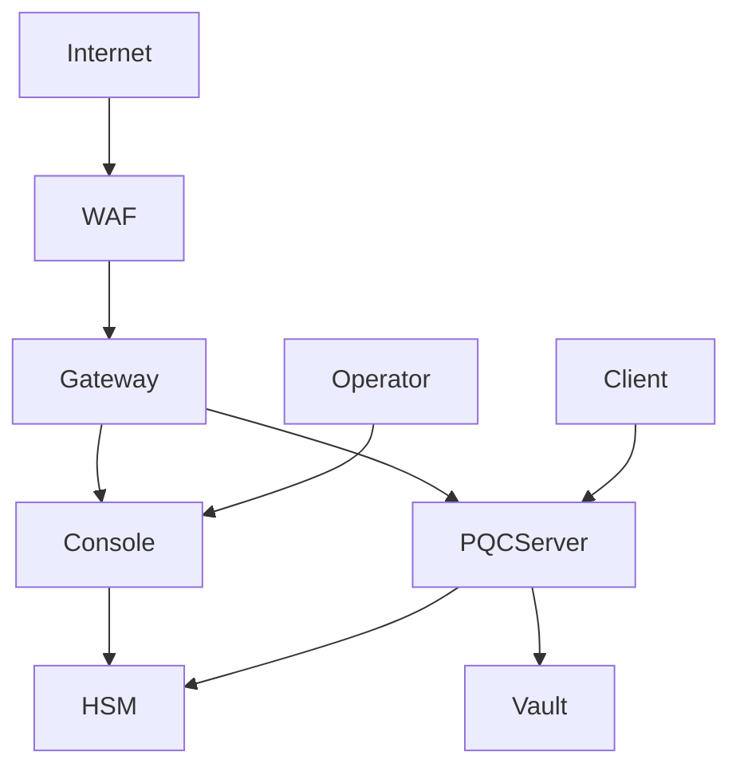

# Nomad Cyber Algorithm — STRIDE Threat Model

Version 1.0 | Last updated: 2026-06-05

## System Overview

Nomad is a post-quantum microservice mesh: PQC TCP channels (Kyber KEM + Dilithium SIG), API gateway, sovereign console, encrypted vaults, and QS-CA PKI.

## Trust Boundaries

| Boundary | Description |
|----------|-------------|
| TB-1 | Internet ↔ WAF/nginx |
| TB-2 | WAF ↔ API Gateway |
| TB-3 | Gateway ↔ PQC Server |
| TB-4 | Console ↔ Operator (WebAuthn) |
| TB-5 | Process ↔ HSM (PKCS#11) |
| TB-6 | Node ↔ TPM (boot attestation) |

## Data Flow Diagram

1. Client initiates PQC handshake → KEM encapsulation → HKDF channel key → AES-GCM records
2. Operator logs into console → Argon2id password → WebAuthn assertion → ZK sovereign proof
3. Gateway validates session token → RBAC → routes to vault/PQC handlers
4. QS-CA issues Dilithium certificate → CT log append → OCSP stapling

## Threat Actors

| Actor | Capability | Goal |
|-------|------------|------|
| External attacker | Network access | Decrypt traffic, forge sessions |
| Insider operator | Console access | Exfiltrate vault data |
| Supply chain | Dependency compromise | Backdoor crypto layer |
| Nation-state | HSM/TPM bypass | Long-term key extraction |

## STRIDE Analysis

### Spoofing
- **Threat:** Forged gateway Bearer token
- **Mitigation:** Session tokens from ConsoleAuthService only; timing-safe validation
- **Control:** C-3 audit chain, gateway session auth tests

### Tampering
- **Threat:** Audit log modification
- **Mitigation:** Chained HMAC entries with `verifyChain()`
- **Control:** NOMAD_AUDIT_CHAIN_KEY

### Repudiation
- **Threat:** Operator denies privileged action
- **Mitigation:** Immutable audit log + CT log for certificate issuance
- **Control:** Append-only JSONL, HMAC chain

### Information Disclosure
- **Threat:** Heap dump exposes private keys
- **Mitigation:** HSM non-extractable keys, Worker thread sandbox
- **Control:** H1, C9

### Denial of Service
- **Threat:** Handshake flood
- **Mitigation:** Rate limiter (local + Redis), connection caps
- **Control:** distributed_rate_limiter.ts

### Elevation of Privilege
- **Threat:** TOTP phishing → console access
- **Mitigation:** FIDO2/WebAuthn with user verification (AAL3)
- **Control:** H2, ZK sovereign layer (C6)

## Residual Risks

| Risk | Severity | Owner | Status |
|------|----------|-------|--------|
| liboqs stub not production liboqs | High | Engineering | Vendor package pending |
| HE vault not activated | Low | Engineering | Interface only (C7) |
| Third-party crypto audit | Medium | Security | P3 organizational |

## Review Cadence

Update this document on every major release and after any security incident.
